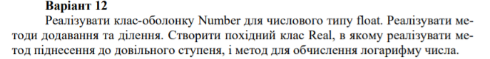

# C++ task with inheritance,

Task description - **implement the Number class for the numeric float type. Implement the methods of addition and division. Create a derived class Real, in which to implement a method for raising to an arbitrary power, and a method for calculating the logarithm of a number**.

console output result:

