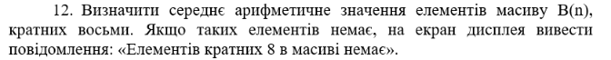
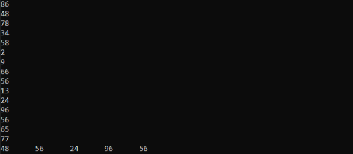

# C++ task with array,

Task description - **Determine the arithmetic mean of the elements of the array B(n) divisible by eight. If there are no such elements, display the message: "There are no elements divisible by 8 in the array".**.

console output result:

