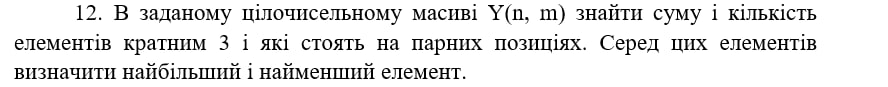
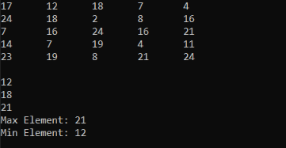

# C++ task with array,

Task description - **In a given integer array Y(n,m) find the sum and the number of elements that are multiples of 3 and are in even positions. Among these elements find the largest and the smallest element.**.

console output result:

