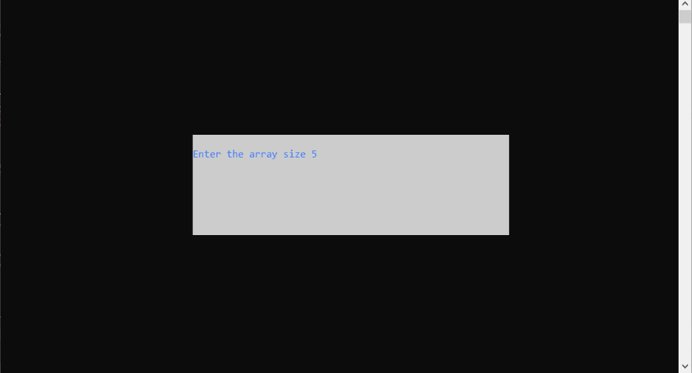
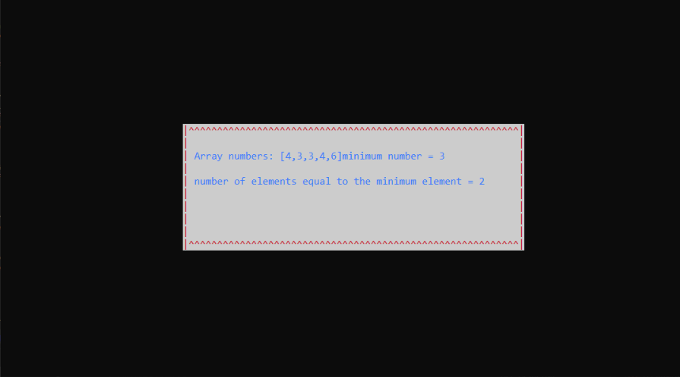

# C++ operation with windows and array class,

Task description - **Write a program using the window and array class in which the user enters the array size, generates random numbers for the array, and displays information about the array (the minimum number and the number of elements equal to the minimum)**.

data entry:

console output result:

